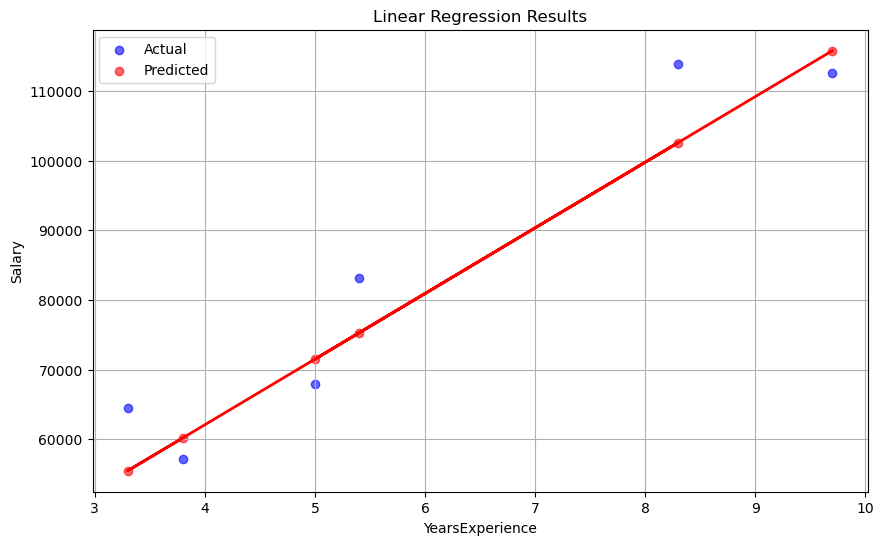

# Linear Regression

## 🔹 Concept
- Linear Regression is a **supervised learning algorithm** used for predicting continuous target variables based on input features.  
- It assumes a **linear relationship** between features (X) and target (y).  
- Best used when the relationship between variables is approximately linear, e.g., predicting salary from years of experience.  

## 🔹 Key Math
- **Hypothesis function:**  

$$
y = \beta_0 + \beta_1x_1 + \beta_2x_2 + \dots + \beta_nx_n
$$

- **Cost/Loss function (MSE):**  

$$
J(\theta) = \frac{1}{m} \sum_{i=1}^m (y_i - \hat{y}_i)^2
$$

- **Optimization method:** Ordinary Least Squares (minimizes sum of squared residuals).  

## 🔹 Steps
1. **Load dataset** using `pandas.read_csv`.  
2. **Preprocess data**: select feature columns `X` and target column `y`.  
3. **Split dataset** into training and testing sets (80:20).  
4. **Train model** using `LinearRegression()` from `sklearn`.  
5. **Evaluate model** using MSE and R² Score.  
6. **Plot results** if only one feature is used:  
   - Scatter plot of actual vs predicted values.  
   - Regression line showing fit.  

## 🔹 Results
- Mean Squared Error: `49830096.8559`  
- R² Score: `0.9024`  
- Coefficients: `[9423.81532303]`  
- Intercept: `24380.2015`  
- Screenshot:   
