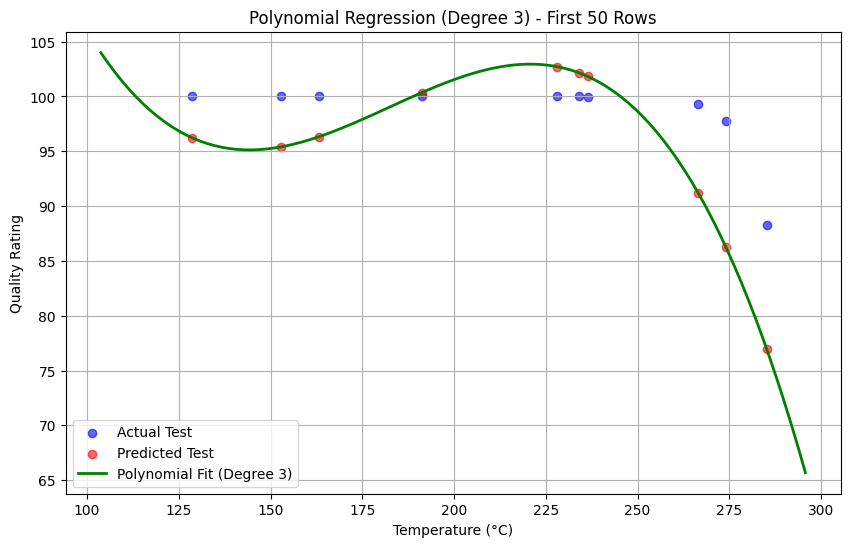

# Polynomial Regression

## 🔹 Concept
- Polynomial Regression is an **extension of Linear Regression** where the relationship between independent (X) and dependent (y) variables is modeled as an nth degree polynomial.  
- It is useful when data shows a **non-linear trend** that a straight line cannot capture.  
- Example: predicting quality rating from temperature where the relationship is curved.  

## 🔹 Key Math
- **Hypothesis function (degree n):**  

$$
y = \beta_0 + \beta_1x + \beta_2x^2 + \dots + \beta_nx^n
$$  

- **Cost function (MSE):**  

$$
J(\theta) = \frac{1}{m} \sum_{i=1}^m (y_i - \hat{y}_i)^2
$$  

- **Optimization method:** Ordinary Least Squares (via polynomial feature expansion + linear regression).  

## 🔹 Steps
1. **Load dataset** using `pandas.read_csv`.  
2. **Preprocess data**: select feature columns `X` and target column `y`.  
3. **Split dataset** into training and testing sets (80:20).  
4. **Transform features** into polynomial terms using `PolynomialFeatures(degree=n)`.  
5. **Train model** using `LinearRegression()` inside a pipeline.  
6. **Evaluate model** using Mean Squared Error (MSE) and R² Score.  
7. **Plot results**:  
   - For single feature → plot polynomial curve over scatter points.  
   - For multiple features → plot Actual vs Predicted values.  

## 🔹 Results
- Polynomial Degree: `3`  
- Mean Squared Error: `39.0308`  
- R² Score: `-2.2293`  
- Screenshot:   
